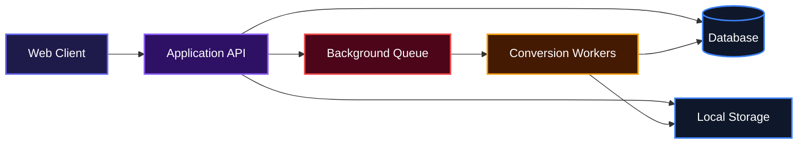
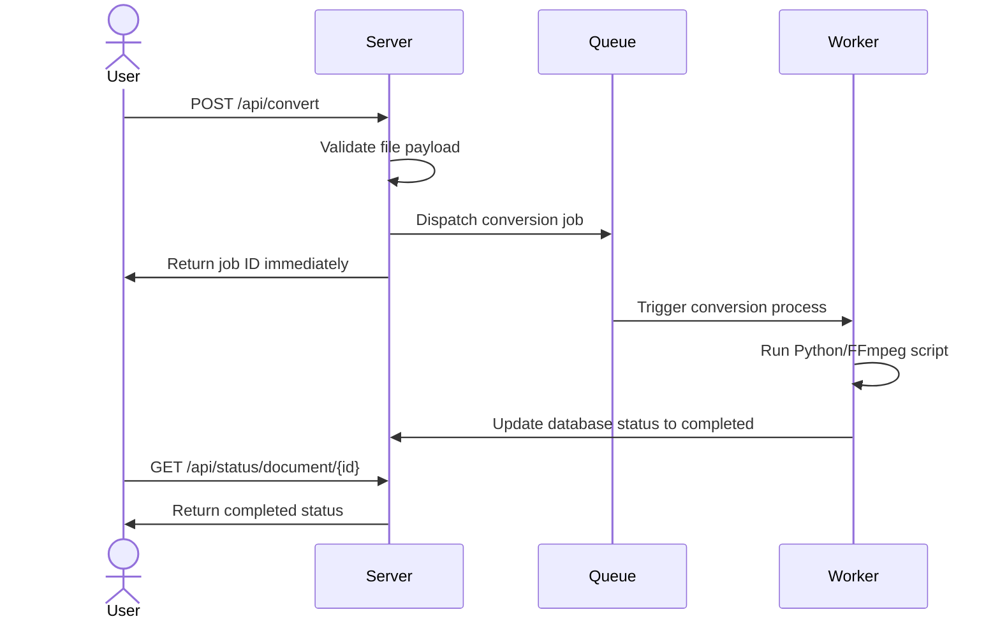

# FilesILove

## Overview
This project helps users convert various files from one format to another safely and efficiently. It takes document or media file inputs, processes them securely in the background, and produces the exact target format needed without injecting ads or watermarks. There is no complicated setup, just straightforward file conversion functionality that works reliably in the browser.

## System Architecture



## Features

*   **Universal File Processing**: Accept standard documents and media files and convert them into widely used formats accurately.
*   **Asynchronous Job Handling**: Offload intensive media processing and document rendering to background queues. This keeps the user interface snappy and prevents long HTTP request timeouts.



*   **Format Detection**: Automatically parse the requested file extension and resolve the appropriate processing pipeline category.
*   **Automated Cleanup**: Schedule background tasks to clean up conversion records and physical files older than 24 hours to preserve disk space.

## Installation

Follow these instructions to set up the project locally.

Clone the Repository:
```bash
git clone https://github.com/Ace-g-ops/files_i_love.git
cd files_i_love
```

Install application dependencies:
```bash
composer install
npm install
npm run build
```

Configure your environment variables:
```bash
cp .env.example .env
php artisan key:generate
```

Set up the database:
```bash
touch database/database.sqlite
php artisan migrate
```

Install Python dependencies for PDF conversion:
```bash
python3 -m venv venv
venv/bin/pip install pdf2docx
```

Note: You must have LibreOffice and FFmpeg installed on your system to run document and media conversions locally. Alternatively, you can use the provided Docker setup.

Using Docker:
```bash
docker build -t files_i_love .
docker run -p 8080:8080 files_i_love
```

## Usage

To start the application, you need to run the web server and the queue worker simultaneously. 

Run the web server:
```bash
php artisan serve
```

In a separate terminal window, start the queue worker to process files:
```bash
php artisan queue:work
```

Once both are running, navigate to `http://localhost:8000` in your browser. You can click the upload area, select a valid file, choose a target format from the dropdown menu, and click "Convert". The application will handle the rest and provide a download link once finished.

## API Documentation

#### POST /api/convert
**Description**: Uploads a document file and initiates a background conversion job.

**Request**:
Requires `multipart/form-data`.
*   `file`: The document file to convert (pdf, docx, txt, html). Max size 400MB.
*   `target_format`: The desired output format extension (e.g., "docx").

**Response**:
```json
{
  "id": 1,
  "message": "Successfully Converted"
}
```

**Errors**:
*   422: Unsupported Conversion or invalid input parameters.

#### POST /api/convert-media
**Description**: Uploads a media file and initiates a background conversion job.

**Request**:
Requires `multipart/form-data`.
*   `file`: The media file to convert (mp3, mp4, aac, wav). Max size 50MB.
*   `target_format`: The desired output format extension.

**Response**:
```json
{
  "message": "File uploaded successfully",
  "media_id": 5
}
```

**Errors**:
*   422: Invalid Format or exceeding size limits.

#### GET /api/status/document/{id}
**Description**: Checks the processing status of a document conversion job.

**Response**:
```json
{
  "status": "processing",
  "error_message": null
}
```

#### GET /api/status/media/{id}
**Description**: Checks the processing status of a media conversion job.

**Response**:
```json
{
  "status": "completed",
  "error_message": null
}
```

#### GET /api/download/{type}/{id}
**Description**: Downloads the converted file. The `type` parameter must be either `document` or `media`.

**Response**:
Returns the physical file stream for download.

**Errors**:
*   202: Conversion is still in progress. Please try again later.
*   404: File not ready or conversion failed.

#### GET /api/formats
**Description**: Returns the configuration array of supported conversion formats.

**Response**:
```json
{
  "document": {
    "formats": {
      "pdf": ["docx"]
    }
  }
}
```

#### GET /api/user/conversions
**Description**: Retrieves the last 10 conversions initiated by the current user session.

**Response**:
```json
[
  {
    "id": 1,
    "original_filename": "example.pdf",
    "status": "completed",
    "target_format": "docx"
  }
]
```

## Technologies Used

*   PHP
*   Laravel
*   SQLite
*   Python
*   FFmpeg
*   LibreOffice
*   TailwindCSS
*   Alpine.js

## Contributing

We welcome contributions to this project. Please ensure that your pull requests clearly describe the changes being made. Write unit tests for new features and make sure all existing tests pass before submitting.

## Author Info

*   GitHub: [Ace-g-ops](https://github.com/Ace-g-ops)
*   Twitter/X: [Ace_theSage](https://x.com/Ace_theSage)

---

[](https://php.net/)
[](https://laravel.com/)
[](https://tailwindcss.com/)
[](https://www.python.org/)
[](https://www.docker.com/)